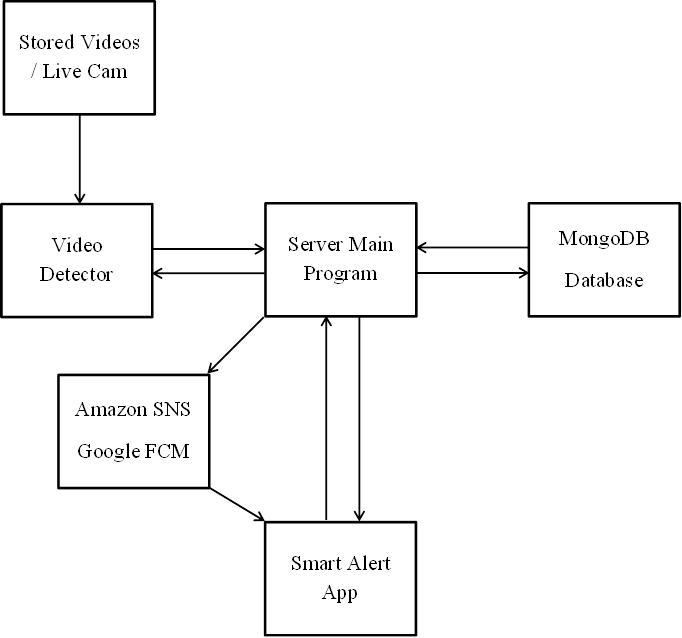
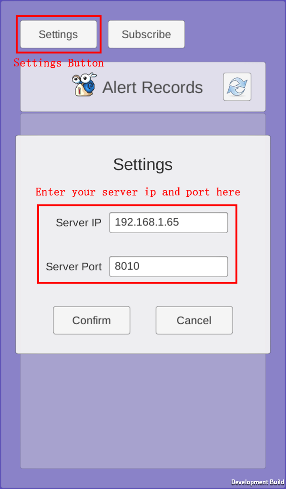
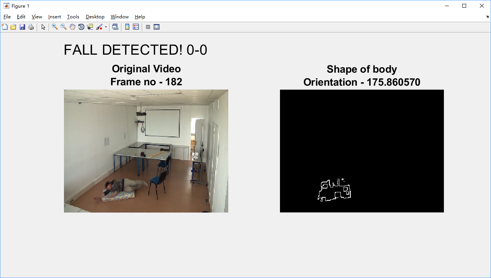
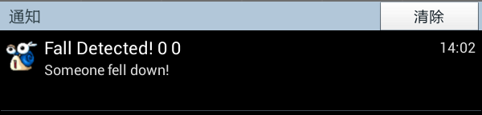

# Smart Video Surveillance System
### For MM802 Course Project

A Smart Video Surveillance System that can analyze the videos taken from live cameras, detect person fall events within the videos, and send alert notifications via a mobile application to the people concerned when a fall event is detected.

 

## System Design

  

#### How does the system work?

First, live camera videos or pre-stored videos are fed into the Video Detector and the Video Detector would detect the fall events within the input videos.
Once a fall event is detected, the Video Detector would send the detection information to the Server Main Program, 
and in response the Server Main Program would send an alert notification to the supervisor’s Smart Alert Mobile App via the push notification services, 
meanwhile the Server Main Program would also save the detection record in the database. 
After receiving the alert notification on the Smart Alert App, 
the supervisor may want to send a request back to the Server Main Program to get the updated detection records and the detected video frames, 
which can let the supervisor double check whether there is a real accident or just a fake alert.

 

## Required Tools and Libraries

* MATLAB (Tested with R2015a and R2017b, but should also work in other not too old versions)
* Python 3 (Tested with Python 3.6.5)
* MongoDB + PyMongo (Tested with PyMongo 3.6.1)
* Boto3 (Tested with Boto3 1.6.18)
* OpenCV-Python (Tested with OpenCV-Python 3.4.0.12)
* Unity (Required for building the Smart Alert App)

 

## Sample Videos

* Download the fall detection sample videos from this link: 
https://drive.google.com/drive/folders/0B537tmZl1HF-UjFGNnc5Sl85Nms?usp=sharing 
(The sample videos are provided by Spxtrm Health Inc. )

* Place the sampled videos in the "Videos" folder or any of its subfolders.

 

## How to Test the System
1. Install the Smart Alert App on your mobile phone either by using the <b>"SmartAlertApp.apk"</b> in <b>"SmartAletApp/Builds/Android"</b> or by rebuilding the <b>"SmartAletApp"</b> Unity project
2. Set the <b>SERVER_HOST</b>, <b>SERVER_PORT</b>, <b>DB_HOST</b>, <b>DB_PORT</b> in the <b>"config.ini"</b> file to your server ip, server port, MongoDB database ip, MongoDB database port respectively.
3. Run the <b>"Server/DBSetup.py"</b> to write video metadata to the database.
4. Run the <b>"Server/ServerMain.py"</b> to start the Server Main Program.
5. Open the Smart Alert App on your mobile phone. Click the <b>Settings Button</b> to open the <b>Settings Panel</b>. Enter your server ip and server port in the <b>Server IP Input Field</b> and <b>Server Port Input Field</b> and click the <b>Confirm Button</b>.

  

6. Run the <b>"FallDetection.m"</b> MATLAB code to start the Video Detector. 
   - To run the "FallDetection.m" code in the <b>MATLAB Command Window</b>, use command: 
	 FallDetection.m  VIDEO_NAME  [SERVER_IP]  [SERVER_PORT] 
	 <b>Example:</b> 
   FallDetection.m  "video (6).avi"  "192.168.1.65"  8010 
   - To run the "FallDetection.m" code in the <b>Window Command Prompt</b>, use command: 
	 MATLAB_EXECUTABLE_PATH  -nodisplay  -nosplash  -nodesktop  -r  "FallDetection  VIDEO_NAME  [SERVER_IP]  [SERVER_PORT]" 
	 <b>Example:</b> 
   "D:\MATLAB\R2017b\bin\matlab.exe"  -nodisplay  -nosplash  -nodesktop  -r  "FallDetection  'video (6).avi'" 

 

Then, when the Video Detector detects a fall event in the video, hopefully the Smart Alert App on your mobile phone will soon receive an alert notification, and you can check out the detection information as well as the detected frames in the app.

  

  

 

## References

The Video Detector MATLAB code is modified from https://github.com/harishrithish7/Fall-Detection
